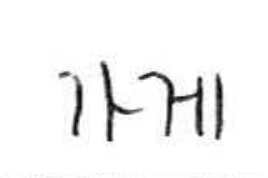

# Text Recognition Model (Sequence Recognition Network)


## 1. 목표

한글 데이터 구축 사업에서 데이터 검증 용으로 이용한  OCR 글자 인식 딥러닝 모델로, `Robust Scene Text Recognition With Automatic Rectification`에서 제시한 모델을 주어진 한글 데이터셋에 맞게 재구성하였습니다.   

## 2. 설치

### (1) Python 환경 설정

해당 딥러닝 모델은 텐서플로우 1.14버전으로 작성되었고, 텍스트영상 처리를 위한 라이브러리로는 opencv-python이 활용되었습니다. 
학습이 필요하지 않는 경우에는, CPU가 설치된 환경만으로도 충분하나, 모델을 학습할 때에는, GPU가 설치된 환경에서 학습시키시길 바랍니다. 

* 파이썬 환경 : Python == 3.6

* 딥러닝 프레임워크 : Tensorflow>=1.14
    ````bash
    pip install tensorflow==1.14 # or tensorflow-gpu==1.14
    ````
* 영상 처리 라이브러리 : opencv-python
    ````bash
    # opencv-python에 필요한 추가 라이브러리
    sudo apt-get install libsm6 libxext6 libxrender1 libxrender-dev libfontconfig1 
    pip install opencv-python
    ````
* 기타 필수 라이브러리
    ````bash
    pip install -r requirements.txt
    ````    
    
### (2) Docker 환경 설정

OCR 모델은 텐서플로우 서빙을 활용해 배포할 수 있도록 구성하였습니다. <br>

#### 1) Docker 설치

텐서플로우 서빙을 활용하기 위해서는 Docker가 필수적으로 설치되어 있어야 합니다. <br>
도커가 설치되어 있지 않는 경우, 아래를 통해 설치해 주시길 바랍니다.

* [Docker 설치 가이드](https://docs.docker.com/v17.12/install/)

#### 2) Docker 권한 설정

도커 설치 후, 현재 사용자에게 docker에 접근할 수 있도록 권한을 제공해 주시면 됩니다.

````bash
sudo groupadd docker
sudo gpasswd -a $USER docker 
newgrp docker
```` 

#### 3) Tensorflow-Serving 이미지 가져오기
모델을 배포하기 위해서는 Tensorflow-serving 이미지를 가져와야 합니다.

````bash
docker pull tensorflow/serving:latest
```` 


## 3. 모델 배포

### (1) OCR 모델 배포하기

아래는 `archieve/alpha/serving`에 저장되어 있는 텐서플로우 모델을 Docker Image를 통해, 서버 형태로 배포하는 코드입니다. 

````bash
docker run -d --rm -p 8500:8500 -p 8501:8501 \
-v "$(pwd)/archieve/alpha/serving/:/models/ocr" \
-e MODEL_NAME=ocr \
tensorflow/serving
````

### (2) example) 모델을 통해 이미지를 처리하기 

아래의 이미지를 서버로 전송해, 결과를 반환 받도록 하겠습니다. 



이미지는 base64 인코딩으로 된 bytes 포맷으로 전송되어야 합니다. 이미지 포맷은 `BMP`, `GIF`, `JPEG`, `PNG` 모두 가능합니다.<br>
 
````bash
curl \
-d \
'{"instances": [{"image": {"b64": "'"$(base64 가게.png)"'"}}]}' \
-X POST http://52.141.37.30:8501/v1/models/ocr:predict
```` 

성공적으로 모델이 배포되었다면, 아래와 같은 결과를 반환하게 됩니다.

````bash
{
    "predictions": [[44032, 44172]]
}
````

위의 숫자는 unicode 번호로, 44032는 `가`, 44172는 `게` 를 의미합니다.

